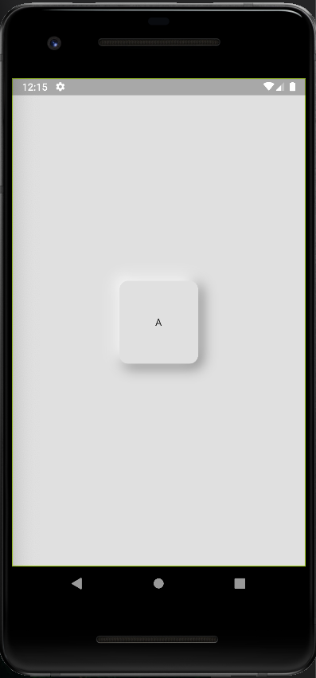
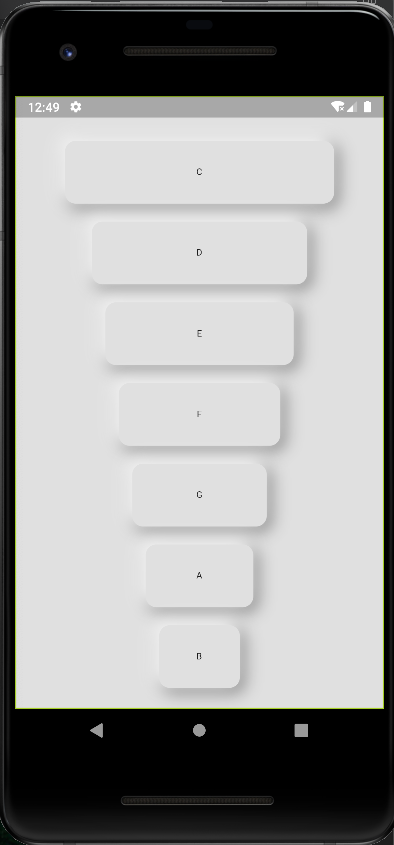
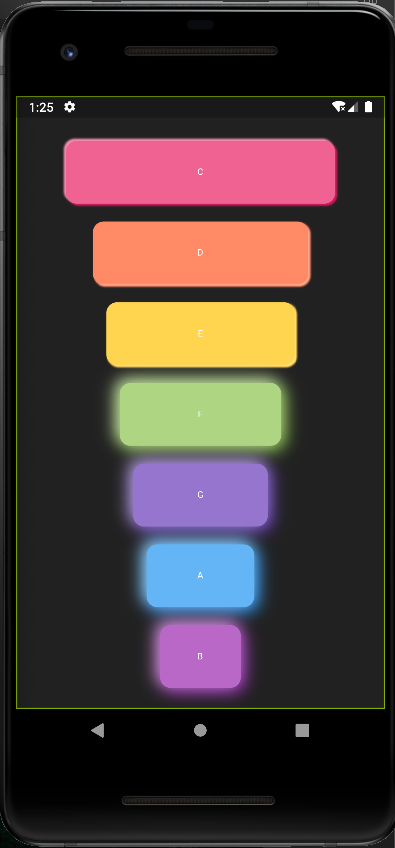

# Neumorphism

Trying out this neumorphism UI style and learnt a couple of things

## Getting Started

Neumorphism seems to work best when the background and elements are similar colours with varying shades.

## Less Appealing
When several differing colours are applied it becomes less appealing. One can even say repulsive

## Out of no where
Decided to build a Xylophone in the end

